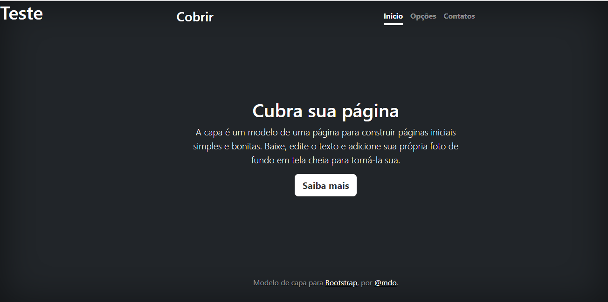

# Indice

 

[Projeto - Portifólio para a escrita do README](#projeto---portif%C3%B3lio-para-a-escrita-do-readme)  
[Descrição](#descri%C3%A7%C3%A3o)  
[Funcionalidades](#funcionalidades)  
[Tecnologias utilizadas](#tecnologias-utilizadas)  
[Fontes consultadas](#fontes-consultadas)  
[Autores](#autores)  

# 🚀 Projeto - Portifólio para a escrita do README

## 📝 Descrição

Este é um modelo de página inicial simples e bonita, projetado para ajudar você a criar uma presença online atraente rapidamente. Com um design limpo e moderno, esta página proporcionará uma experiência agradável aos visitantes, transmitindo profissionalismo e estilo.

## ⚙️ Funcionalidades

mostrar como funciona a utilização do Bootstrap

### 💻 Tecnologias utilizadas

- Git  

- GitHub  

- HTML  

- CSS  

- Vs Code   

 
## 🔎 Fontes consultadas

Bootstrap, por @mdo.

## 🙎🏽 Autores

Ruan Pablo 
Geovanna Dama 
Leonardo Rocha